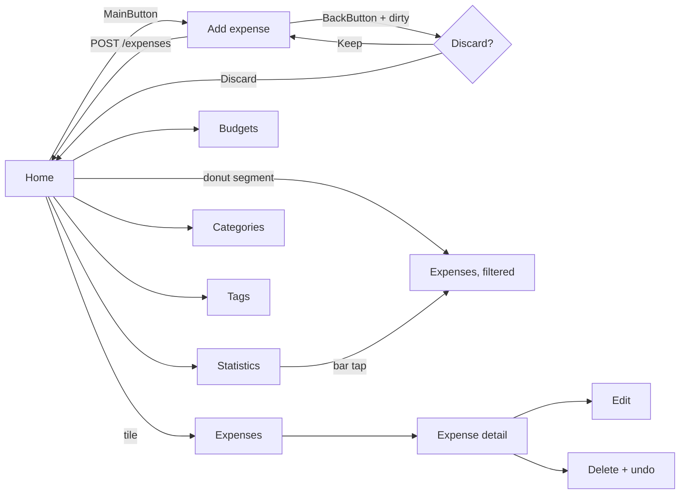

# UX brief: CashFlow Telegram Mini App

Design input for a future `docs/plans/mini-app-v2.md`. This file describes
**what each screen must do and which states it must survive**; the plan file
derives units and acceptance criteria from it. Written as a contract, not as a
mood board — every "States" list below is an acceptance criterion.

Visual reference (live, theme-aware mockups of all seven screens):
https://claude.ai/code/artifact/32fd8317-d2f0-4279-8709-af3b261b79fa

Companion plans: `docs/plans/expense-tracker-mvp.md` (V1 MVP, D1–D45),
`docs/plans/family-features-v1_1.md` (V1.1, D100–D124). Decision ids in this
document and its plan start at **D200** to avoid collisions.

---

## 0. Blocking decisions

These are not design preferences — each one changes what the screens can do.
None of the units below can be written until every `DECIDE` here is resolved.
Record each answer in the plan's Decision log as D200+.

- **DECIDE D200 — Authentication.** The Mini App runs in the user's browser;
  `INTERNAL_TOKEN` can never ship to it (root CLAUDE.md: the bot's header pair
  is a shared secret). Options: (a) the backend validates Telegram's signed
  `initData` HMAC as a second auth path beside `get_current_user`, deriving the
  user from `initData.user.id` exactly as it derives one from
  `X-Telegram-User-Id` today; (b) a thin BFF holds the internal token and
  proxies. **Recommendation: (a)** — one new dependency in `api/deps.py`, no new
  service, and the permission pipeline downstream is untouched.
- **DECIDE D201 — Public origin.** `docker-compose.prod.yml` deliberately
  publishes no ports (the bot long-polls outward). A Mini App needs a public
  HTTPS origin: domain, TLS, reverse proxy, CORS allowlist. Decide the proxy
  (Caddy vs nginx) and whether the app is served by FastAPI `StaticFiles` or its
  own container.
- **DECIDE D202 — Frontend stack.** Recommendation: TypeScript + Vite, no
  framework or a small one. The app is seven screens with no shared client state
  beyond a cache; a heavyweight framework buys nothing and costs bundle size on
  mobile.
- **DECIDE D203 — Currency.** The mockups show `€`. `family_tz` exists in
  config; there is no currency setting. Decide: a `FAMILY_CURRENCY` env var (one
  currency per deployment) or a per-account column. Recommendation: env var —
  the family has one currency, and a column implies conversion logic nobody
  asked for.
- **DECIDE D204 — Scope parity.** Which bot commands the Mini App replaces in
  v1. Recommendation: screens 01–05 in v1 (home, add, expenses, budgets,
  statistics); categories and tags management stay bot-only until M3. The bot is
  never retired — it stays the fastest path for a one-line expense and the only
  surface for notifications.
- **DECIDE D205 — Bot allowlist.** The bot's `AllowlistMiddleware` in
  `bot/middlewares.py` gates on a `users`-table lookup. The Mini App does not
  go through that middleware, so its gate is the same `users` table lookup
  that `get_current_user` already does. This is either fine (the user row is
  the real allowlist) or it is the moment to do the allowlist→DB migration
  that root CLAUDE.md names as the V2 admin-panel prerequisite. Decide which.

---

## 1. Who it is for

Two adults sharing one account, on phones, one-handed, usually standing in a
shop or sitting in a car. Not accountants — they want to know whether this month
is going badly, and to record a purchase before they forget it.

The three jobs, in priority order:

1. **Record an expense in under ten seconds.** The bot's FSM needs five turns
   because chat has no other option. A form does not.
2. **See the month at a glance.** Today this requires `/statistics`, then
   `/chart`, then reading text. It should be the first thing on screen.
3. **See what the other person spent.** `user_name` already ships on every
   expense (U1.3) but the bot only appends it to a text line.

Anything else — managing categories, renaming tags, editing permissions — is
rare enough to stay in the bot or sit behind two taps.

---

## 2. Design principles

Three rules that resolve most detail questions without another round of review.

1. **Colour belongs to data.** Buttons, headers, nav and chrome are ink
   (near-black on light, near-white on dark). The only saturated colour on any
   screen is a spending category. Consequence: a glance at any screen tells you
   where money went, not where to tap.
2. **One screen per intent.** Adding an expense is amount, category, tags and
   comment on a single surface — no wizard, no confirm step. If a flow needs a
   second screen, question the flow.
3. **Native, not branded.** Grouped cards, 42px headers, a bottom main button.
   The app inherits the Telegram theme rather than fighting it; the only place
   it asserts an identity is the ink chrome.

---

## 3. Screen inventory

The table is the unit list in miniature. **One screen plus all of its states is
one unit.**

| # | Screen | Job | Data in | Actions out |
|---|--------|-----|---------|-------------|
| 01 | Home | The month as one shape | `GET /statistics/by-category`, `GET /budgets`, `GET /users/me` | navigate; open add-expense |
| 02 | Add expense | Record in <10s | `GET /categories`, `GET /tags` (cached) | `POST /expenses` |
| 03 | Expenses | What happened, and who did it | `GET /expenses?limit&offset` | `PATCH`/`DELETE /expenses/{id}` |
| 04 | Budgets | Am I about to overspend | `GET /budgets`, `GET /budgets/{id}/progress` | `POST`/`PATCH`/`DELETE /budgets` |
| 05 | Statistics | The same shape, deeper | `GET /statistics/by-period\|by-category\|by-tag` | period + grouping switch; drill-down |
| 06 | Categories | Where colour is assigned | `GET /categories`, `GET /statistics/by-category` | `POST`/`PATCH`/`DELETE /categories/{id}` |
| 07 | Tags | The cross-cutting axis | `GET /tags`, `GET /statistics/by-tag` | `POST`/`PATCH`/`DELETE /tags/{id}` |

### Five states every screen must handle

Not optional, and each one is a separate acceptance criterion:

1. **Loading** — a skeleton that occupies the final layout, so nothing reflows.
2. **Empty** — specific to the filter in force, never a generic "no data".
3. **Error** — what failed and a retry affordance; never a raw status code.
4. **Permission denied (403)** — reachable in this app: the permission matrix
   has `own_only` for expense update/delete, and override rows can restrict
   further (MVP D26/D33). A viewer sees read-only screens, not broken buttons.
5. **Offline** — Telegram webviews lose connectivity constantly. Show the last
   loaded data with a "last synced" marker rather than an empty screen.

---

## 4. Screen specifications

### 01 — Home

The donut answers "where did it go?" before a number is read. Total in the hole;
the three largest categories named underneath, so identity is never carried by
colour alone. An over-budget category gets a strip above the fold. Six tiles are
the whole app. MainButton is Add expense.

- **States**: loading (donut skeleton) · empty ("No expenses yet — add your
  first", tiles still reachable) · error retry · offline banner with last-synced
  time · single category (donut renders, no legend needed).
- **Telegram**: MainButton = Add expense; BackButton hidden (this is the root);
  selection haptic on tile tap.
- **Interaction**: tapping a donut segment shows the exact slice and navigates to
  that category's filtered expense list.

### 02 — Add expense

The screen that justifies the project. Amount is focused on open so the numeric
keypad is up immediately. Category and tags are chips toggled in place. The
MainButton restates what will happen (`Add €38.40 to Groceries`) and is disabled
until a category is chosen.

- **States**: no category chosen (button disabled, labelled "Choose a category")
  · invalid amount (inline, never a popup) · 403 · 404 on a stale category id ·
  network failure with the draft preserved · duplicate rapid submit → exactly
  one `POST` (same double-tap guard as the bot's confirm step, D118/D123).
- **Telegram**: MainButton is the submit; BackButton asks to discard when the
  draft is dirty; success haptic, then close back to Home with the donut redrawn.
- **Rule**: amount parses to minor units in exactly one helper with its own
  tests, mirroring `bot/handlers/expenses.py::parse_amount_to_minor_units`
  (comma and dot, `1 234,56`, reject `<= 0`).

### 03 — Expenses

Grouped by day with a per-day subtotal — a flat list of 38 rows answers nothing,
the same list grouped answers "was Saturday expensive?" with no interaction.
Each row: category colour, title, author initial, tags, amount.

- **States**: loading skeleton rows · empty per filter ("Nothing in July for
  Transport") · `own_only` in force → only your own rows, silently (no error) ·
  end-of-list marker · delete failure restores the row.
- **Telegram**: BackButton → Home; haptic on swipe-delete; a 5s undo toast
  **before** the API call, not after.
- **Depends on**: real pagination (see §8). The bot truncates client-side at 30;
  a scrolling list cannot.

### 04 — Budgets

Every bar carries a tick at the notify threshold, so "80%" stops being a number
in a form and becomes a line you watch yourself approach. The bar is the
category's own colour, never repainted by status. State is spelled out in words
with an icon. Categories with no budget sit at the bottom as an invitation.

- **States**: no budgets at all · over budget · past threshold · 409 duplicate
  plan for a category · 403 for viewers · category deleted underneath a plan.
- **Telegram**: MainButton is contextual — it offers the next unbudgeted
  category.
- **Note**: threshold crossings still fire the existing fan-out notification to
  every account member (U1.4/D104). The Mini App changes nothing there.

### 05 — Statistics

Home's donut plus ranked bars underneath, so switching screens never re-teaches
the picture. Bars sorted by amount, leader at full width; value always printed,
never inferred from an axis. Period presets are the same three the bot supports.
"By tag" is the same view with a different grouping, not a different screen.

- **States**: loading (bars at zero width, no reflow) · empty period · single
  category · error retry.
- **Telegram**: selection haptic on preset change; BackButton → Home.
- **Note**: this is where MVP D121's deferred "real chart" lands, and where
  D120's UTC-vs-`family_tz` boundary discrepancy should be fixed in the API
  rather than re-implemented in a second client.

### 06 — Categories

The one screen with a job the bot never had: it is where a category's colour is
chosen and stored, which is what makes every donut, dot and bar elsewhere
consistent. Each row doubles as a mini-report (count + month total). The
`ON DELETE RESTRICT` rule (MVP D5) is explained *before* the tap, not as a 409
afterwards.

- **States**: delete blocked by RESTRICT (pre-empted inline, 409 still handled)
  · 403 · duplicate name (note: names are **not** unique at the DB level, MVP
  D19 — decide whether the UI warns or the schema gains a constraint) · last
  remaining category.
- **Telegram**: MainButton = Save, enabled only when the form is dirty.
- **Depends on**: a `categories.color` column (see §8).

### 07 — Tags

Tags are the cross-cutting axis: `#vacation` spans groceries, transport and
cafés, which no category view can show. So tapping a tag breaks it down by
category. Renaming and deleting are the secondary action at the bottom, because
that is how often they happen.

- **States**: no tags yet (explain what a tag is for, then offer three starters)
  · unused tag (count 0) · 403 · delete confirms in a Telegram popup, not a
  custom modal.
- **Open**: per-tag counts need either a count field on `GET /tags` or a
  client-side roll-up of the expense list. Decide before the unit is written.

---

## 5. Flows

Every flow that can lose typed input must confirm before discarding it. Every
flow that mutates must survive a double submit with exactly one write.

---

## 6. Visual system

| Token | Light | Dark | Use |
|-------|-------|------|-----|
| App background | `#EDF0EF` | `#101415` | Grouped-list ground |
| Card | `#FFFFFF` | `#1C2123` | Every content surface |
| Ink | `#0E1416` | `#F1F5F4` | Text, buttons, chrome |
| Ink secondary | `#6C7679` | `#97A1A3` | Meta, labels |
| Separator | `#E4E8E7` | `#272D2F` | Row rules |

**Category palette** — the validated colourblind-safe set, assigned in fixed
slot order and **never cycled**. A category keeps its colour when filters change.

| Slot | Light | Dark |
|------|-------|------|
| 1 | `#2a78d6` | `#3987e5` |
| 2 | `#eb6834` | `#d95926` |
| 3 | `#1baf7a` | `#199e70` |
| 4 | `#eda100` | `#c98500` |
| 5 | `#e87ba4` | `#d55181` |
| 6 | `#008300` | `#008300` |

Status red (`#e34948` / `#e66767`) is **reserved for over-budget** and never
used as a seventh category. It always ships with an icon and a word, so the
state survives greyscale and colourblind readers.

More than six categories: fold the tail into "Other" in the donut and keep the
full list in the ranked bars. Never generate a seventh hue.

**Type**: system UI stack throughout (whatever Telegram renders in). Amounts use
tabular numerals at 700 weight and −0.035em tracking so columns line up and
decimals do not dance. Section eyebrows are the only mono, at 10px/0.11em
uppercase.

**Geometry**: 14px card radius · 12px fields · 9px chips · 999px pills. Donut
segments carry a 2px gap so adjacent colours never touch. Bar fills are rounded
only on the data end and anchored to the baseline.

---

## 7. Content rules

- **Money** is `BIGINT` minor units end to end. Exactly one format helper and
  one parse helper on the client, each with its own tests. Never a float,
  including intermediate math.
- **Dates** render in `family_tz`, not the device timezone, so both members see
  the same "today".
- **Copy** names things the way a person would: "Over by €23.90", not
  "fill_pct 120". Errors say what went wrong and what to do. Buttons say what
  happens, then the result confirms it happened.
- **Language**: EN only in v1 unless D203's sibling decision says otherwise; the
  existing smoke runbook is bilingual, so RU is a plausible follow-up.

---

## 8. Backend deltas this design forces

Each item is a screen that cannot render without it. These belong in an **M0
milestone that lands before any screen unit**, exactly as U0.1/U0.2 preceded M1
in the family plan.

| Delta | Why | Blocking |
|-------|-----|----------|
| `initData` auth dependency | The browser cannot hold `INTERNAL_TOKEN` | All screens |
| Public HTTPS origin + CORS | Prod compose publishes no ports | All screens |
| `GET /users/me` | Home needs the viewer's own name and role; `api/users.py` is admin-only (MVP D27), so a member gets 403 asking who they are | 01 |
| `limit`/`offset` on `GET /expenses` | The bot truncates at 30 client-side; a scrolling list cannot. `ORDER BY created_at DESC` from U2.5 is already the right sort | 03 |
| `categories.color` column | Colour derived from list position changes every time a category is added. Assign from the fixed slot order on create, never random. **Migration — root CLAUDE.md stop-and-ask gate applies** | 06, and every donut |
| Period bounds computed server-side | D120's UTC-vs-`family_tz` discrepancy would be duplicated in a second client. Give the API a months-back parameter and let `services/period.py::month_bounds` do it | 05 |
| Per-tag expense counts | Either a count on `GET /tags` or a client roll-up — decide | 07 |

Two of these touch reviewed contracts: `categories.color` needs a migration
(explicit human approval, per root CLAUDE.md's do-not-edit list), and the
period-bounds change alters the statistics query contract from V1.1.

---

## 9. Non-functional acceptance criteria

- **No secret in the client bundle.** Add a grep step to `scripts/verify.sh`
  that fails on `INTERNAL_TOKEN`, `BOT_TOKEN` or `DATABASE_URL` appearing in
  build output. This is the one that must never regress.
- **Bundle** under 150 KB gzipped; first meaningful paint under 1.5 s on a
  throttled 3G profile.
- **Backend unchanged for the bot.** Every existing bot test stays green; the
  `initData` path is additive, never a replacement for the header pair.
- **Theme**: both light and dark rendered from Telegram's theme params, verified
  in both.
- **Layering unchanged**: the Mini App is another HTTP client, exactly like the
  bot. No new business logic leaves `services/`.

---

## 10. Screen → unit map

Proposed milestones for `docs/plans/mini-app-v2.md`.

| Milestone | Unit | Depends on | Ships |
|-----------|------|------------|-------|
| M0 | `initData` auth dependency | — | A second auth path; the bot's is untouched |
| M0 | Public origin, TLS, CORS | MVP U6.1 (CD) | Reachable from Telegram at all |
| M0 | Contract deltas: `/users/me`, pagination, `categories.color` | initData auth | The U0.2 equivalent. **Migration gate.** |
| M1 | App shell: theme tokens, routing, API client, error boundary | All of M0 | BackButton/MainButton wiring, 403 handling |
| M1 | Screen 01 — Home + donut | App shell | The pitch in one screen; demo-able |
| M1 | Screen 02 — Add expense | App shell | The reason the Mini App exists |
| M2 | Screen 03 — Expenses list, detail, edit, delete | Pagination | Parity with `/expenses`, `/editexpense`, `/deleteexpense` |
| M2 | Screen 04 — Budgets | Home | Parity with `/budgets` + the threshold tick |
| M2 | Screen 05 — Statistics | Home donut | Parity with `/statistics` and `/chart` |
| M3 | Screens 06 + 07 — Categories, Tags | `categories.color` | The management tail; lowest traffic, last |
| M3 | e2e smoke through `initData` | Everything | The U3.1 equivalent for the new client |

Risky units (reviewer subagent required, per the project's own rule): the
`initData` auth dependency and the CORS/origin unit — both are permission- and
secret-adjacent.

---

## 11. Open questions

Carry each into the plan's Decision log as it is answered.

- D200–D205 in §0, all still open.
- Category name uniqueness: warn in the UI, or add the DB constraint MVP D19
  deliberately left out?
- Does the Mini App need offline write queueing, or is read-only offline enough
  for v1? (Recommendation: read-only — a queued write that fails a permission
  check hours later is worse than no queue.)
- Should the bot link to the Mini App from `/start`, and if so does that replace
  any bot command or merely add a button?
